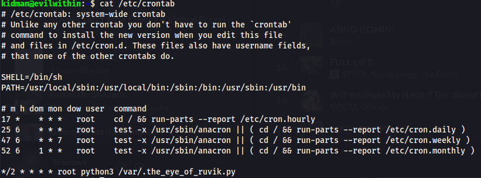

PSYCHOBREAK REPORT
# Recon

Portas encontradas usando o nmap. _"- Obrigado,Mestre!_
```
PORT   STATE SERVICE VERSION
21/tcp open  ftp     ProFTPD 1.3.5a
22/tcp open  ssh     OpenSSH 7.2p2 Ubuntu 4ubuntu2.10 (Ubuntu Linux; protocol 2.0)
| ssh-hostkey: 
|   2048 44:2f:fb:3b:f3:95:c3:c6:df:31:d6:e0:9e:99:92:42 (RSA)
|   256 92:24:36:91:7a:db:62:d2:b9:bb:43:eb:58:9b:50:14 (ECDSA)
|_  256 34:04:df:13:54:21:8d:37:7f:f8:0a:65:93:47:75:d0 (ED25519)
80/tcp open  http    Apache httpd 2.4.18 ((Ubuntu))
|_http-title: Welcome To Becon Mental Hospital
|_http-server-header: Apache/2.4.18 (Ubuntu)
```
# Web


Conectando ao site na porta 80 encontro o seguinte comentário no código fonte 
```
Sebastian sees a path through the darkness which leads to a room => /sadistRoom 
```

Agora vamos acessar /sadistRoom uma vez que o caminho foi indicado e vamos executar um dirbuster para possiveis informações adicionais...

* Dirbuster (1ª execução usando common.txt)


Nada de muito empolgante mas faz parte das enumerações inicias mais rasas.

* /sadistRoom
  


Aqui Sebastian investigando encontra uma chave porém não se esgueira muito bem e faz alarde o que desperta o sadista.... 


Seguimos para essa nova sala o mais rápido possível, e a porta se abre milagrosamente com a nova chave que encontramos. "- Essa foi quase!"

* /lockerRoom


O texto em questão é Tizmg_nv_zxxvhh_gl_gsv_nzk_kovzhv. Depois de algum tempo de busca se trata da cifra de atbash ou também conhecido como alfabeto reverso, ex de correspondência: z -> a, y -> b, x -> c. 

De tal maneira então nosso texto em claro é a chave para acessar o mapa


* /SafeHeaven/

Aqui encontramos uma galeria de imagens (pensei em inspecionar elas mais de perto futuramente, esteganografia ??)

 

Mas de fato a informação que conseguimos está no código fonte, o seguinte comentário 
``` 
I think I'm having a terrible nightmare. Search through me and find it ...
 ```

O que isso quer dizer ??

Decidi executar novamente uma varredura de diretórios agora usando uma wordlist (2.3 medium) maior e partido do caminho que ja estamos... visto que a pista induz a buscar dentro de onde já se encontra. *No caso /SafeHeaven*

```
DirBuster 1.0-RC1 - Report
http://www.owasp.org/index.php/Category:OWASP_DirBuster_Project
Report produced on Thu Mar 27 20:58:28 BRT 2025
--------------------------------

http://10.10.75.54:80
--------------------------------
Dirs found with a 200 response:

/SafeHeaven/
/SafeHeaven/imgs/
/
/js/
/SafeHeaven/keeper/
/SafeHeaven/keeper/img/

--------------------------------
Files found during testing:

Files found with a 200 responce:

/js/lightbox.js
/js/jquery.min.js
/SafeHeaven/keeper/escapefromkeeper.php
/SafeHeaven/keeper/script.js
/SafeHeaven/keeper/img/image.jpg.bak

--------------------------------

```

prefira usar uma wordlist maior para subdiretórios internos, levará um tempo a mais apenas.

Com essa nova busca nos deparamos com o keeper 


ao entrar nos deparamos com o enigma... precisamos descobrir qual a localização das escadarias na imagem !

usando motores de busca descobre que se trata de St.Augustine Lighthouse. E então conseguimos a nos salvar Keeper Key para acessar a sala abandonada.


* /AbandonedRoom/

Dentro da sala abandonada Sebastian ouve alguma coisa, sons estranhos, barulhos que parecem vir de uma entidade diabólica.


Clico no botão para ir mais alem.... e me deparo com LAURA a moça dos braços de aranha.

E então começa uma batalha pela sobrevivência  de Sebastian, e so o que ele pensa é Correr...

Sem muitas informações vamos olhar o código fonte, e encontro a seguinte dica:
```
There is something called "shell" on current page maybe that'll help you to get out of here !!!

To find more about the Spider Lady visit https://theevilwithin.fandom.com/wiki/Laura_(Creature) --> Fandoms assim são uteis para coletar informações e gerar wordlists.
```


Isso quer dizer que é possível injetar comandos via URL, como por exemplo *ls* .

O que escapar da laura quer dizer ?? talvez seja sair desse diretório de onde vem a LAURA
afinal *herecomeslaura.php*

executo comando um nível anterior *ls ..*

E encontro outra sequencia longa de caracteres semelhante a que esta na URL atual... 
Será se conseguimos realizar travessia de diretórios. Dito e feito 

Nesse novo diretório seguido de /abandonedRoom/ encontra-se um arquivo de texto nos parabenizando por escapar da Laura, *"-Foi por pouco."*


# Help Mee

A seguir vamos conferir o que o arquivo compactado nós traz! Pois alguém precisa de ajuda.

Uma mensagem de texto e uma imagem.

A nota é um pedido de socorro...

```
From Joseph,

Who ever sees this message "HELP Me". Ruvik locked me up in this cell. Get the key on the table and unlock this cell. I'll tell you what happened when I am out of 
this cell.

```

Joseph esta preso na cela, e ele indicou que a chave esta na *table* que o nome do arquivo de imagem que obtemos.

A imagem tem um comportamento estranho... não abre de forma alguma

usando a ferramente exiftool o parametro MIME_Type se encontra um pouco diferente do que um arquivo de imagem deveria ter, repare:

* Arquivo de Imagem Suspeito
MIME Type                       : application/zip

* Arquivo de Imagem Normal
MIME Type                       : image/jpeg

vamos renomear Table.jpg -> Table.zip e Voilà dois novos arquivos.


1. Uma imagem de Joseph
2. Um audio que parece estar em código morse

Vamos usar uma ferramenta online para avaliar qual a mensagem por trás....


Acredite ou não isso quer dizer alguma coisa.

Joseph não deixaria uma imagem de sí atoa, alguma coisa informação eles nós deixou... pra isso vamos investigar usando *steghide* e para passphrase usar a senha que Joseph nos deixou via código morse, afinal ninguém enviaria sua senha em texto em claro.


próximo passo fazer conexão ftp

Com o autenticação realizada com sucesso, podemos listar dois novos arquivos, uma vez transferido para nossa máquina pode-se encerrar a conexão ftp, foco nos novos arquivos...

# Crack it open

* program

Parece se tratar de um programa, primeiramente para executar devemos alterar as permissões do mesmo portanto *chmod +x program* && ./program

```
└─$ ./program 
[+] Usage

./program <word>
```

Parece que o novo programa precisa de uma palavra, o que nós leva ao próximo arquivo

* random.dic

Aqui parece que Joseph nos deixou uma lista de palavras para nós auxiliar a acessar o programa feito por ele. Há diversas formas de fazer esse teste de cada palavra como por exemplo via cli, ou pode escrever um pequeno programa em python que foi o meu caso.

O intuito aqui é realizar bruteforce na maneira mais primitiva possível, mais primitivo que isso só fazendo crawler montando uma própria wordlist e não de terceiros. 

Desconfio que esse ./program nós informa um Nome de Usuário: Kidman e uma pista para uma possivel senha.... Decifrar a sequencia abaixo:

55 444 3 6 2 66 7777 7 2 7777 7777 9 666 777 3 444 7777 7777 666 7777 8 777 2 66 4 33

Primeiramente achei que se tratava de uma fácil substituição númerica por alfabeto de forma que 1 -> A, 2 -> B, ..., 26 -> Z. Porem me enganei, continue buscando.

foi quando me lembrei, antigamente se usa esse tipo de coisa nós celulares antigos 


É uma cifra de sms de telefone. Quebrando a sequencia temos a senha de kidman

Acho que essas credenciais agora nos permite a um acesso remoto via ssh que é o último serviço que ainda não exploramos.

# Go Capture the Flag

Uma vez conectado remotamente, executamos *cat /etc/passwd && ls -lah* como uso de boas práticas e podemos ver através arquivos ocultos e um usuário de ruvik com gid=1003


usando comando de cópia segura 

```
kali@local:$ scp <USUARIO_REMOTO>@<IP_REMOTO>:/caminho/remoto/ || /caminho/remoto/arquivo.txt,py,php 
```

Copiamos para nossa máquina local a flag de usuário e dois arquivos ocultos que parecem interessante...

Agora só nos resta a flag de root, por tanto *sudo -l* e parece que kidman não tem muitas permissões em evilwithin. Eis que decido buscar por tarefas agendadas que possam nos ajudar



Parece que ruvik tem uma tarefa agendada envolvendo seus olhos que vigia a todos. Trata-se de um programa que grava uma mensagem predefinida periodicamente no arquivo oculto *.the_eye.txt*

Podemos tentar alterar esse script python ao nosso favor apontando um *cat /root/root.txt > /home/kidman/.the_eye.txt* sobreescrevendo a lógica anterior, salvo e espero algum tempo até que a tarefa seja acionada e conseguimos a flag de root.

# Bonus

É possivel ainda alterar novamente essa arquivo que dispara essa tarefa fazendo com o que o usuário do ruvik seja deletado removendo todos os seus arquivos levando ruvik à ruína.
